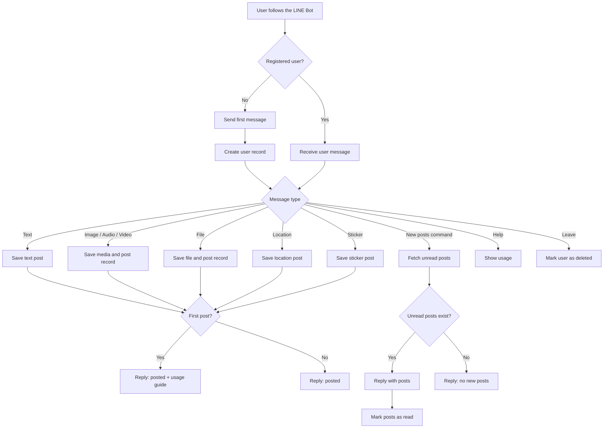
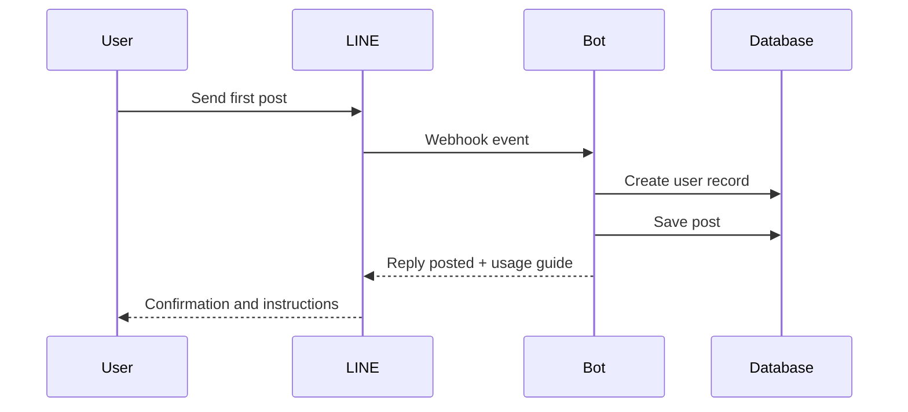
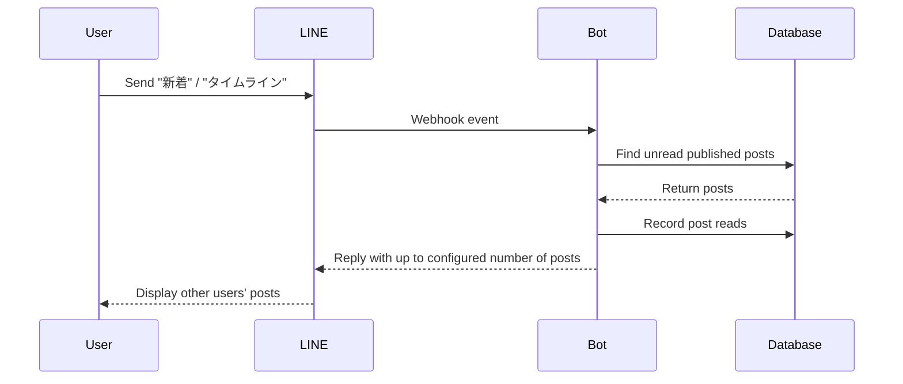
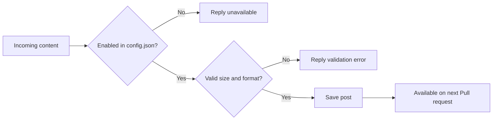

# User Flow

## Overview

```mermaid
flowchart TD
    A[User follows the LINE Bot] --> B{Registered user?}
    B -- No --> C[Send first message]
    C --> D[Create user record]
    B -- Yes --> E[Receive user message]
    D --> F{Message type}
    E --> F

    F -- Text --> G[Save text post]
    F -- Image / Audio / Video --> H[Save media and post record]
    F -- File --> I[Save file and post record]
    F -- Location --> J[Save location post]
    F -- Sticker --> K[Save sticker post]
    F -- New posts command --> L[Fetch unread posts]
    F -- Help --> M[Show usage]
    F -- Leave --> N[Mark user as deleted]

    G --> O{First post?}
    H --> O
    I --> O
    J --> O
    K --> O
    O -- Yes --> P[Reply: posted + usage guide]
    O -- No --> Q[Reply: posted]

    L --> R{Unread posts exist?}
    R -- Yes --> S[Reply with posts]
    R -- No --> T[Reply: no new posts]
    S --> U[Mark posts as read]
```

## First-time user flow

```mermaid
sequenceDiagram
    participant U as User
    participant L as LINE
    participant B as Bot
    participant DB as Database

    U->>L: Send first post
    L->>B: Webhook event
    B->>DB: Create user record
    B->>DB: Save post
    B-->>L: Reply posted + usage guide
    L-->>U: Confirmation and instructions
```

## Pull-based timeline flow

```mermaid
sequenceDiagram
    participant U as User
    participant L as LINE
    participant B as Bot
    participant DB as Database

    U->>L: Send "新着" / "タイムライン"
    L->>B: Webhook event
    B->>DB: Find unread published posts
    DB-->>B: Return posts
    B->>DB: Record post reads
    B-->>L: Reply with up to configured number of posts
    L-->>U: Display other users' posts
```

## Content rules

```mermaid
flowchart LR
    A[Incoming content] --> B{Enabled in config.json?}
    B -- No --> C[Reply unavailable]
    B -- Yes --> D{Valid size and format?}
    D -- No --> E[Reply validation error]
    D -- Yes --> F[Save post]
    F --> G[Available on next Pull request]
```
