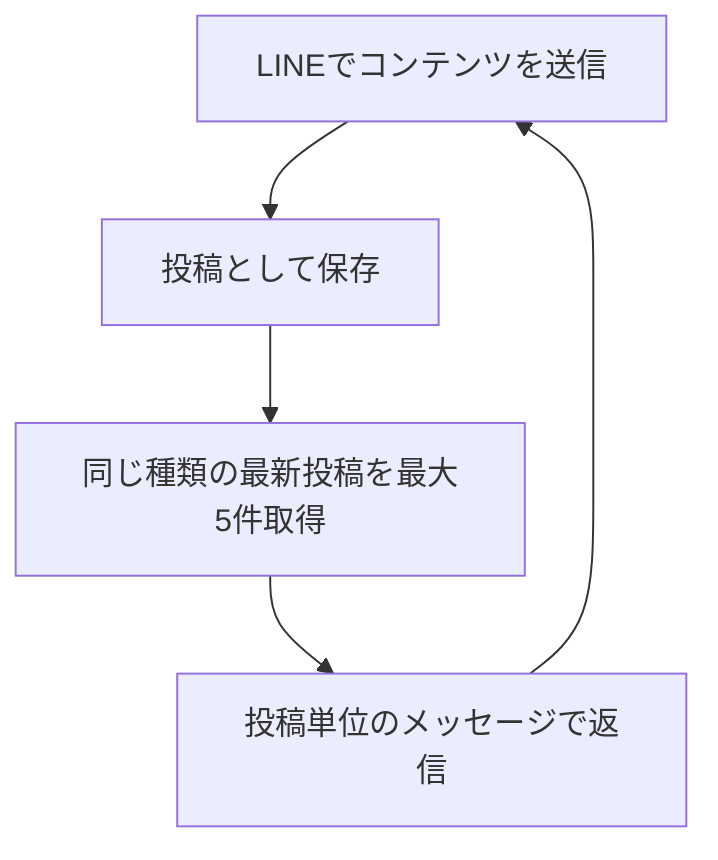
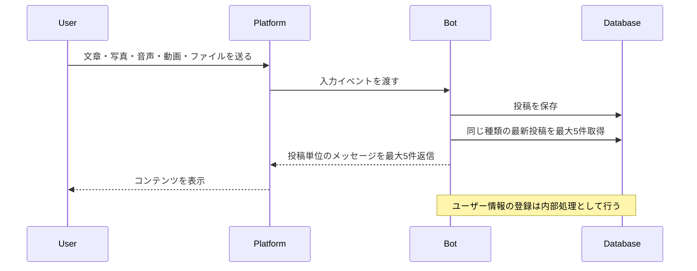

# User Flow

## 正本

この資料は [core-spec.md](core-spec.md) の固定フローを図で示す。

## 固定フロー

## コンテンツ投稿

## 入力と動作

| 入力 | 動作 |
| --- | --- |
| 対応投稿（文章・写真・音声・動画・ファイル） | 保存し、同じ種類の最新投稿を最大5件、投稿単位で返信 |

返信の形式は入力コンテンツに合わせる。文章は文章、写真は写真、音声は音声、動画は動画として返信する。ファイルは公開URLをテキストで返信する。

## 重要な制約

- ユーザー登録操作を要求しない
- ボタンやリッチメニューを必須にしない
- Botから先にPush通知しない
- 投稿者名やユーザーIDを表示しない
- 検索、編集、コメント、リアクションはMVPに含めない
