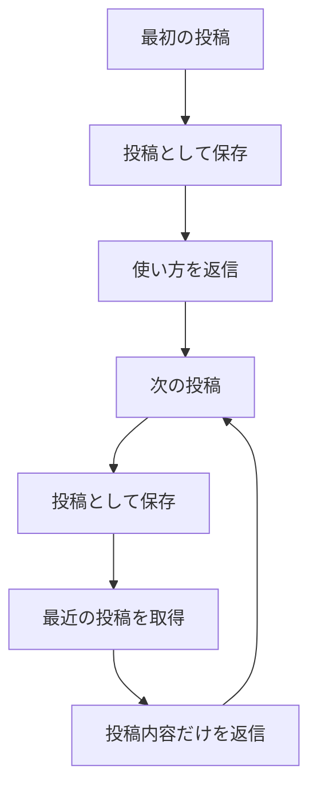
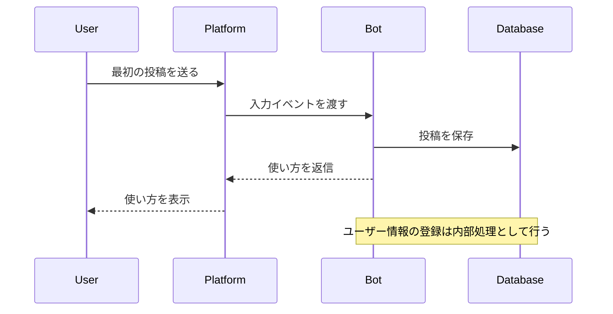
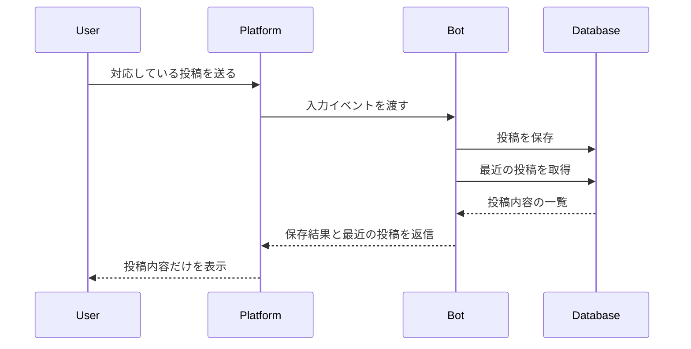

# User Flow

## 正本

この資料は [core-spec.md](core-spec.md) の固定フローを図で示す。

## 固定フロー

## 最初の投稿

## 2回目以降の入力

## 入力と動作

| 入力 | 動作 |
| --- | --- |
| 最初の対応投稿（文章・写真・音声・動画・ファイル） | 保存し、使い方を返信 |
| 2回目以降の対応投稿（文章・写真・音声・動画・ファイル） | 保存し、最近の投稿を返信 |

返信の形式は、MVPではテキスト形式を基本とする。入力コンテンツに合わせた形式での返信（写真には写真、動画には動画）は将来対応する。

## 重要な制約

- ユーザー登録操作を要求しない
- ボタンやリッチメニューを必須にしない
- Botから先にPush通知しない
- 投稿者名やユーザーIDを表示しない
- 検索、編集、コメント、リアクションはMVPに含めない
